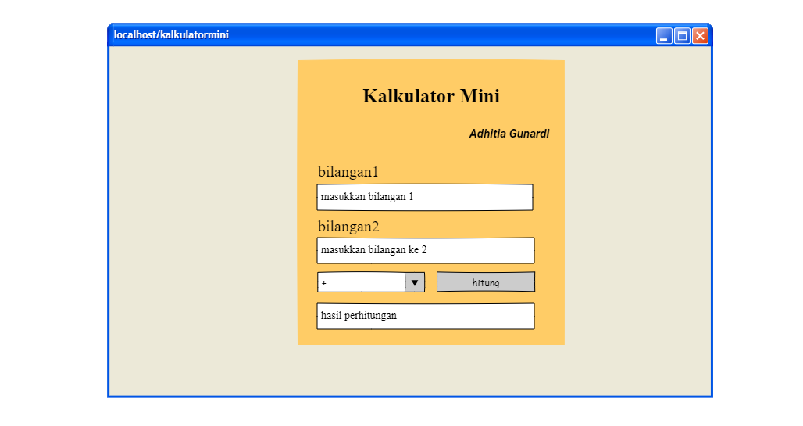

# Description
program kalkulator mini ini dibuat untung menghitung. program ini dibuat menggunakan bahasa pemrograman **HTML(Hypertext Markup Language)**, **CSS(Cascading Style Sheet)**,dan **PHP(Hypertext Processor)** Menggunakan framework Pencil **Pencil**>

# Requiements
* XAMPP :PHP>=3.3.0
* Google Crome >=89.0.4389.114
* Pencil >=3.1.0.ga-x86_64

# Program Kalkulator Mini

# hardware
* LAPTOP/PC
* Memory Ram 4gb/8Gb
* windows 8/10/11/16
* bisa pake  Linux
# aplikasi itubisa dijalankan 
* melalui windows 8/10/11 dengan  versi yang berbeda
* linux  dengan versi yang berbeda/sesuai  versinya
* os  dengan berbagai versi yg disediakan

# menu kalkulator
* bottom tombol hitung
* form input bilangan pertama
* form input bilangan kedua
* list (tambah,kurang,bagi,kali)

# kegunaannya kalkulator mini 
* alat untuk menghitung dari perhitungan sederhana seperti penjumlahan, pengurangan, perkalian dan pembagian sampai kepada kalkulator sains yang dapat menghitung rumus matematika tertentu.

